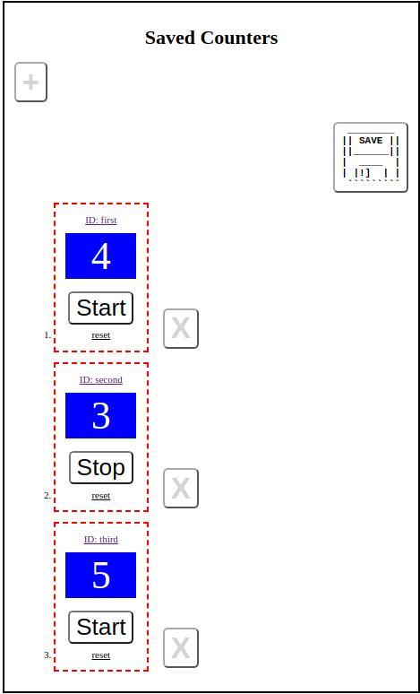

# Count2Many
Exploring Redux by overdoing the standard "simple counter" example a bit

## Project why?
This is just a fun little project to brush up my Redux skills (also an excuse to try out PHP and SQL) and hits all the main points:

- actions
- action creators
- async thunk action creators
- reducers
- middleware
- store
- dispatch
- connect

It is interesting to note the difference between the new "standard way" to build Redux applications that the Redux page recommends (Immer library, createSlice, createReducer, etc.) and most projects "in the wild" created before the latest releases.

In addition to all the Redux code, there's some of the common React stuff:

- react router
- hooks
- function components
- render prop pattern
- even checked out the Downshift library (didn't end up using it though)

## Project what?

This lets you create an owner name for the timers you'll create and then create and name as many counters as you like and persist them to a database ~~(temporarily a simple file write with PHP back-end)~~ by clicking the save button - enjoy the progress indicator :)

You can also view each counter on its own page by clicking its name then remove them when you are done.

## Project where?

You can now try it out [here](http://chalk.infinityfreeapp.com/Count2Many/main.html).

## Project thoughts

The PHP code is super basic and amateurish as I'm new to it. It needs filters for input, removal of some hardcoding, better organization, better use of PDO capabilities, etc. etc.
